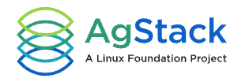
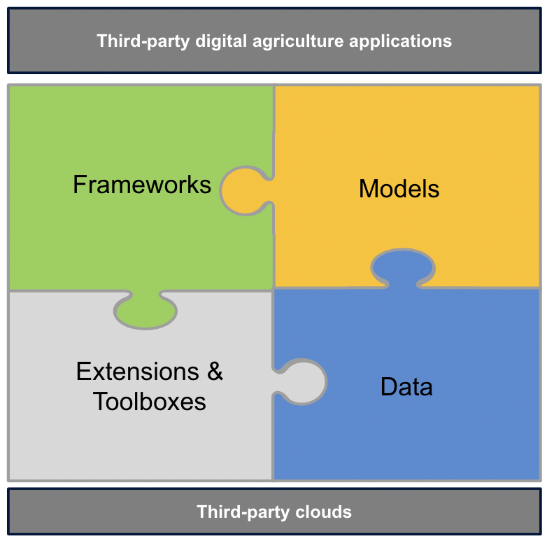
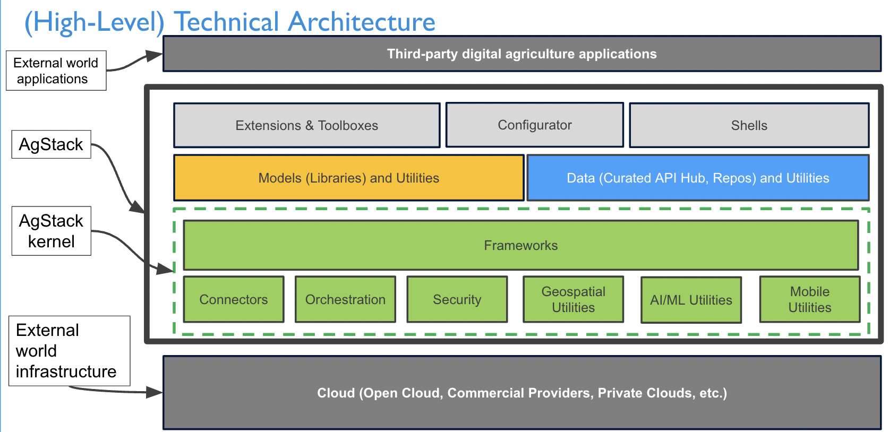

# AgStack 

## About

AgStack Foundation is commissioning software infrastructure like tools, frameworks, and models that are needed to build, manage, and run applications through open source. This Linux Foundation project is an operating system for food and agricultural applications run by members and users.

## Mission statement

Our focus is to accelerate integration and enable innovation where producers, consumers, and stakeholders can benefit, along with impacting Corporate Social Responsibility (CSR) for our members.

## Architectural overview

AgStack is an open source digital infrastructure for agricultural ecosystems. Use the AgStack project to create, publish and use agronomically-relevant software and data. The following components comprise the AgStack architecture: 

* Frameworks
* Models
* Extensions and toolboxes, and
* Data (hosted web services, Digital Public Goods (DPG), etc).

View the following diagram:

  

### Technical architecture

  

## Licenses

* [Apache 2.0](https://www.apache.org/licenses/)
* [Community Data License 2.0](https://cdla.dev/permissive-2-0/)

